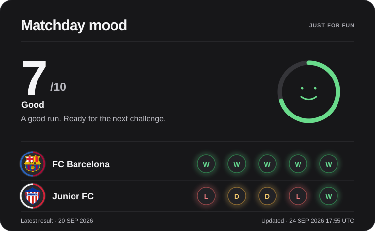

# Esteban Mercado Rachath
**Systems Engineering student · Backend systems · Graph algorithms · Data**  
Barranquilla, Colombia · UTC−5

> Systems Engineering student in my final stage at Universidad de la Costa. I build projects focused on backend development, graph algorithms, web applications, and data analysis. I enjoy working through performance problems and writing clear, maintainable code.

[LinkedIn](https://www.linkedin.com/in/estebandmr) &nbsp;·&nbsp; [GitHub](https://github.com/EstebanDMR) &nbsp;·&nbsp; [Email](mailto:mercadorachath@gmail.com)

---

## ⚡ MOOD MONITOR

A small automated experiment that turns the five latest completed matches from **FC Barcelona** and **Junior FC de Barranquilla** into my current developer mood.

<!-- MOOD_START -->
<picture>
  <source media="(max-width: 600px)" srcset="assets/mood-monitor-mobile.svg" />
  
</picture>
<!-- MOOD_END -->

<b>How the Mood Monitor works</b>

 

* **Results:** Python fetches match schedules from ESPN for LaLiga and Liga BetPlay, then takes each club's five latest completed matches.
* **Score:** A win adds 2 points, a draw adds 0, and a loss subtracts 2. The combined result is mapped to a score from 0 to 100.
* **Updates:** GitHub Actions runs the script twice daily. When results change, it regenerates the desktop and mobile SVG cards and updates the README image description.
* **If data is unavailable:** Network errors or a response with no usable matches leave the existing README and cards in place.

---

## SELECTED ENGINEERING WORK

Personal and academic projects where I worked on APIs, graph algorithms, web interfaces, and data analysis.

### 01 &nbsp;·&nbsp; [RouteOptimizer](https://github.com/EstebanDMR/RouteOptimizer)
**Route planning and graph algorithm visualizer**

* **The Project:** Built a route planning app to compare Dijkstra and A* on weighted graphs and show how each algorithm explores the network.
* **Technical Highlights:**
  * Implemented an adjacency-list graph and a binary min-heap priority queue in TypeScript. Heap insertion and extraction take `O(log n)` time.
  * Added **Dijkstra** and **A\*** with Euclidean and Manhattan distance heuristics.
  * Recorded search steps for playback on an interactive SVG graph.
  * Tested graph operations, algorithms, and API endpoints with **Vitest**.
* **Stack:** TypeScript 5.5 · React 18 · Node.js / Express · Vite · Tailwind CSS · Vitest

[Source Code ↗](https://github.com/EstebanDMR/RouteOptimizer)

---

### 02 &nbsp;·&nbsp; [SalesFlow CRM API](https://github.com/EstebanDMR/salesflow-crm-api)
**REST API for managing sales pipelines, clients, users, and deals**

* **The Project:** Built an API with authentication, role-based permissions, request validation, and controlled access to sales data.
* **Technical Highlights:**
  * Organized routes, controllers, services, and middleware by feature.
  * Added **RBAC** for users and sales data, plus **Zod** validation for request parameters, queries, and bodies.
  * Used **Pino** for structured request logging, **Helmet** for HTTP headers, and rate limiting on authentication routes.
  * Added a **Docker** setup and interactive **Swagger / OpenAPI** documentation.
* **Stack:** Node.js · Express.js · PostgreSQL · Prisma ORM · JWT · Docker · Swagger / OpenAPI

[Interactive Swagger Docs ↗](https://salesflow-crm-api-n44y.onrender.com/api/docs) &nbsp;·&nbsp; [Source Code ↗](https://github.com/EstebanDMR/salesflow-crm-api)

---

### 03 &nbsp;·&nbsp; [Base Electoral](https://github.com/EstebanDMR/base-electoral)
**Multi-user electoral data management platform**

* **The Problem:** The first version loaded and filtered voter records in the browser. The project documents slowdowns once the dataset passed 1,000 records.
* **Technical Highlights:**
  * Moved Firebase access into a service layer, separate from the React views.
  * Added bounded prefix-search queries with `startAt`, `endAt`, and `limitToFirst`. The main voter table still paginates the loaded records in the browser.
  * Added team-based access, role checks, real-time role updates, and Excel exports with **ExcelJS**.
* **Stack:** React 19 · Firebase · Vite · Tailwind CSS · ExcelJS · Lucide React

[Live Platform ↗](https://base-electoral.vercel.app/) &nbsp;·&nbsp; [Source Code ↗](https://github.com/EstebanDMR/base-electoral)

---

### Secondary Spotlight &nbsp;·&nbsp; [University Analytics Dashboard](https://github.com/EstebanDMR/university-dashboard)
**University data analytics dashboard**

* An academic project for Data Mining coursework at Universidad de la Costa.
* Visualizes admissions, enrollment, student retention, and satisfaction trends across years and departments.
* **Stack:** Python 3 · Streamlit · Pandas · Matplotlib · Seaborn · Jupyter Notebook

[Source Code ↗](https://github.com/EstebanDMR/university-dashboard)

---

## ENGINEERING FOCUS

- **Backend & systems** — REST APIs, authentication, RBAC, validation, structured logging.
- **Algorithms & graphs** — Dijkstra, A*, binary min-heaps, graph traversal, heuristics.
- **Data systems** — SQL, PostgreSQL, Firebase queries, data analysis with Pandas.
- **Web platforms** — TypeScript, React, interactive SVG, Vite.

---

## TECHNICAL STACK

Technologies used across the projects above, grouped by the work they support.

<h3 align="center">Languages</h3>

   
  TypeScript · JavaScript · Python · SQL

<h3 align="center">Frontend</h3>

   
  React · Tailwind CSS · Vite · Lucide React

<h3 align="center">Backend</h3>

   
  Node.js · Express.js · Prisma ORM · REST APIs · JWT · Zod

<h3 align="center">Databases</h3>

   
  PostgreSQL · Firebase Realtime Database

<h3 align="center">Data / Analytics</h3>

   
  Pandas · Matplotlib · Seaborn · Streamlit · Jupyter

<h3 align="center">Testing</h3>

   
  Vitest · Jest · Supertest

<h3 align="center">DevOps / Tooling</h3>

   
  Docker · Git · GitHub Actions · Postman · Vercel · Render · Swagger / OpenAPI

---

## ENGINEERING PRINCIPLES

1. **Understand before abstracting.** I prefer understanding the problem before choosing tools or architecture.
2. **Keep boundaries clear.** Separating UI, business logic, and data access makes projects easier to change.
3. **Measure before optimizing.** Performance work should solve a problem I've observed, not one I've imagined.

---

## GET IN TOUCH

I am looking for my first opportunity in software development, backend development, or data and analytics. I am also open to discussing these projects and collaborating on open-source work.

* **LinkedIn:** [linkedin.com/in/estebandmr](https://www.linkedin.com/in/estebandmr)
* **GitHub:** [github.com/EstebanDMR](https://github.com/EstebanDMR)
* **Email:** [mercadorachath@gmail.com](mailto:mercadorachath@gmail.com)
* **Location:** Barranquilla, Colombia

**Build → Measure → Optimize → Scale → Repeat**
