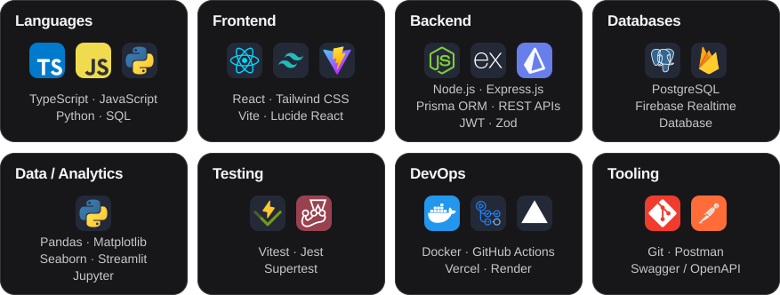

# Esteban Mercado Rachath
**Systems Engineering student · Software Development · Data Analytics**  
Barranquilla, Colombia · UTC−5

> Systems Engineering student in my final stage at Universidad de la Costa. I build projects focused on backend development, graph algorithms, web applications, and data analysis. I enjoy working through performance problems and writing clear, maintainable code.

[Portfolio](https://estebandmr.vercel.app/) &nbsp;·&nbsp; [LinkedIn](https://www.linkedin.com/in/estebandmr) &nbsp;·&nbsp; [GitHub](https://github.com/EstebanDMR) &nbsp;·&nbsp; [Email](mailto:mercadorachath@gmail.com)

---

## MOOD MONITOR

A small automated experiment that turns the five latest completed matches from **FC Barcelona** and **Junior FC de Barranquilla** into my current developer mood.

<!-- MOOD_START -->
<picture>
  <source media="(max-width: 600px)" srcset="assets/mood-monitor-mobile.svg" />
  
</picture>
<!-- MOOD_END -->

Just for fun — football results don't affect my work or availability.

<b>How the Mood Monitor works</b>

 

* **Results:** Python fetches match schedules from ESPN across competitions, then takes each club's five latest completed matches.
* **Score:** A win adds 2 points, a draw adds 0, and a loss subtracts 2. The combined result is calculated from 0 to 100, then shown on a 1–10 scale with five playful mood states.
* **Updates:** GitHub Actions runs the script twice daily. When results change, it regenerates the desktop and mobile SVG cards and updates the README image description.
* **If data is unavailable:** Network errors or a response with no usable matches leave the existing README and cards in place.

---

## SELECTED ENGINEERING WORK

Personal and academic projects where I worked on APIs, graph algorithms, web interfaces, and data analysis.

### 01 / [RouteOptimizer](https://github.com/EstebanDMR/RouteOptimizer)
*Route planning and graph algorithm visualizer*

**TypeScript · React · Dijkstra · A\* · Vitest**

Built a route planning app to compare Dijkstra and A* on weighted graphs and show how each algorithm explores the network.

* Implemented an adjacency-list graph and a binary min-heap priority queue in TypeScript. Heap insertion and extraction take `O(log n)` time.
* Added **Dijkstra** and **A\*** with Euclidean and Manhattan distance heuristics.
* Recorded search steps for playback on an interactive SVG graph.
* Tested graph operations, algorithms, and API endpoints with **Vitest**.

[Source Code ↗](https://github.com/EstebanDMR/RouteOptimizer)

---

### 02 / [SalesFlow CRM API](https://github.com/EstebanDMR/salesflow-crm-api)
*REST API for managing sales pipelines, clients, users, and deals*

**Node.js · PostgreSQL · Prisma · RBAC · Docker**

Built an API with authentication, role-based permissions, request validation, and controlled access to sales data.

* Organized routes, controllers, services, and middleware by feature.
* Added **RBAC** for users and sales data, plus **Zod** validation for request parameters, queries, and bodies.
* Used **Pino** for structured request logging, **Helmet** for HTTP headers, and rate limiting on authentication routes.
* Added a **Docker** setup and interactive **Swagger / OpenAPI** documentation.

[Interactive Swagger Docs ↗](https://salesflow-crm-api-n44y.onrender.com/api/docs) &nbsp;·&nbsp; [Source Code ↗](https://github.com/EstebanDMR/salesflow-crm-api)

---

### 03 / [Base Electoral](https://github.com/EstebanDMR/base-electoral)
*Multi-user electoral data management platform*

**React · Firebase · Pagination · RBAC · ExcelJS**

The first version loaded and filtered voter records in the browser. The project documents slowdowns once the dataset passed 1,000 records.

* Moved Firebase access into a service layer, separate from the React views.
* Added bounded prefix-search queries with `startAt`, `endAt`, and `limitToFirst`. The main voter table still paginates the loaded records in the browser.
* Added team-based access, role checks, real-time role updates, and Excel exports with **ExcelJS**.

[Live Platform ↗](https://base-electoral.vercel.app/) &nbsp;·&nbsp; [Source Code ↗](https://github.com/EstebanDMR/base-electoral)

---

#### Secondary Spotlight / [University Analytics Dashboard](https://github.com/EstebanDMR/university-dashboard)
*University data analytics dashboard*

An academic project for Data Mining coursework at Universidad de la Costa. It visualizes admissions, enrollment, student retention, and satisfaction trends across years and departments.

Python · Streamlit · Pandas · Matplotlib

[Source Code ↗](https://github.com/EstebanDMR/university-dashboard)

---

## TECHNICAL STACK

Technologies used across the projects above, grouped by the work they support.

<picture>
  <source media="(max-width: 600px)" srcset="assets/technical-stack-mobile.svg" />
  
</picture>

---

## ENGINEERING PRINCIPLES

1. **Understand before abstracting.** I prefer understanding the problem before choosing tools or architecture.
2. **Keep boundaries clear.** Separating UI, business logic, and data access makes projects easier to change.
3. **Measure before optimizing.** Performance work should solve a problem I've observed, not one I've imagined.

---

## GET IN TOUCH

I'm currently open to junior opportunities in software development and data analytics. I'm also open to discussing my projects and collaborating on open-source work.

* **Portfolio:** [estebandmr.vercel.app](https://estebandmr.vercel.app/)
* **LinkedIn:** [linkedin.com/in/estebandmr](https://www.linkedin.com/in/estebandmr)
* **GitHub:** [github.com/EstebanDMR](https://github.com/EstebanDMR)
* **Email:** [mercadorachath@gmail.com](mailto:mercadorachath@gmail.com)
* **Location:** Barranquilla, Colombia

**Build → Measure → Optimize → Scale → Repeat**
